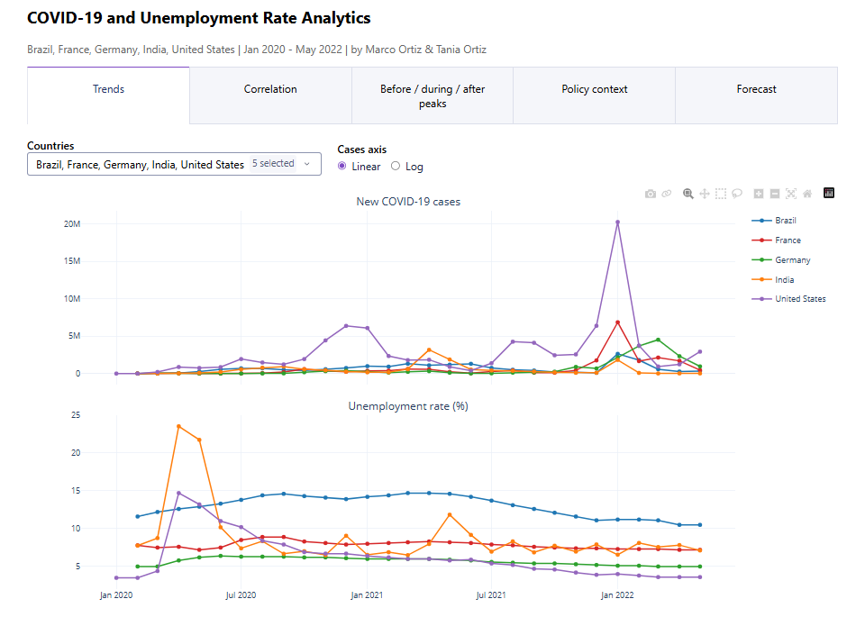
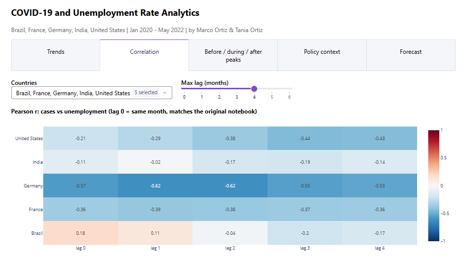
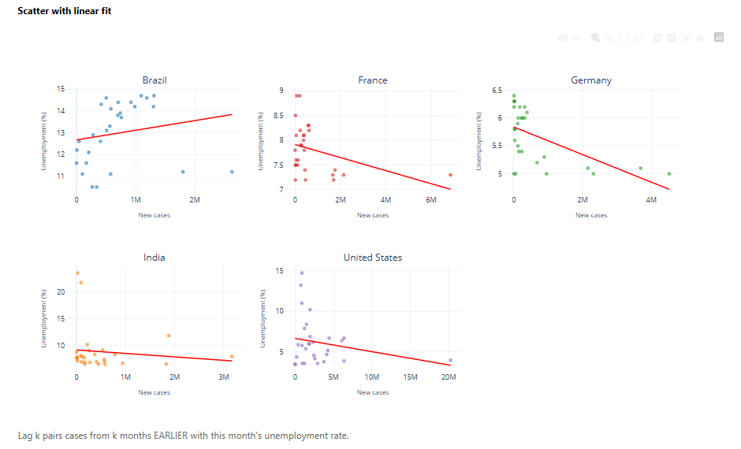
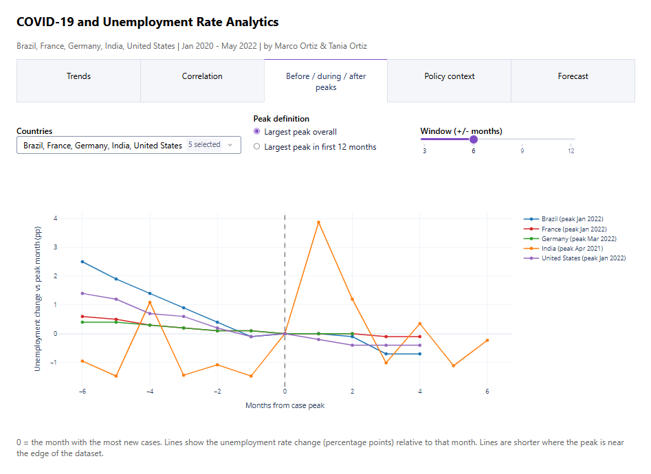
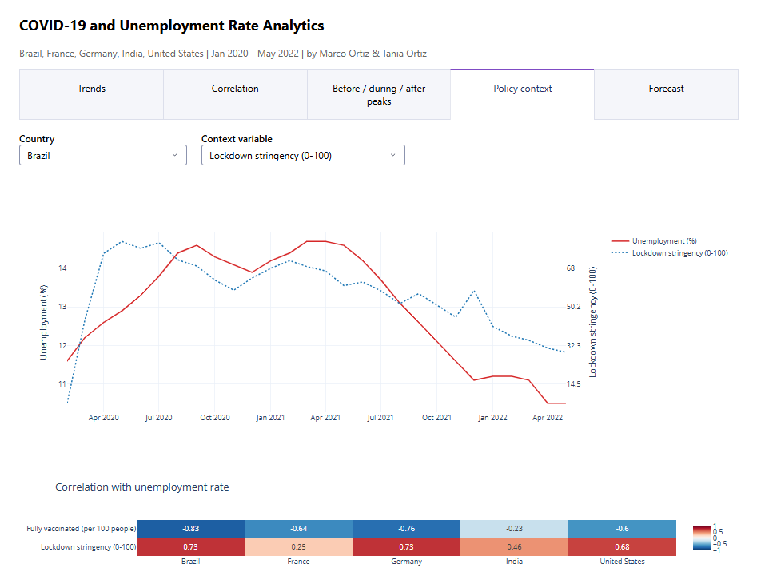
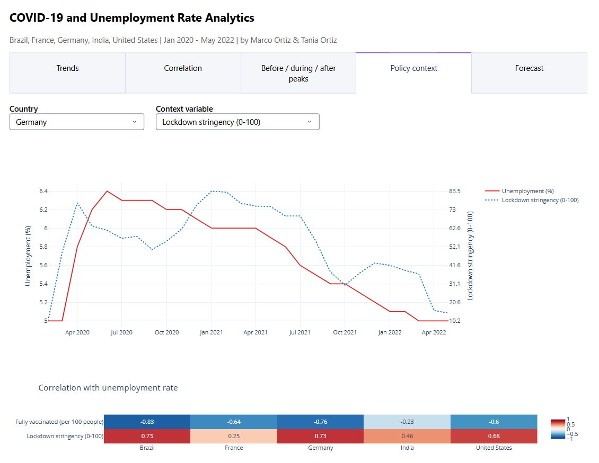
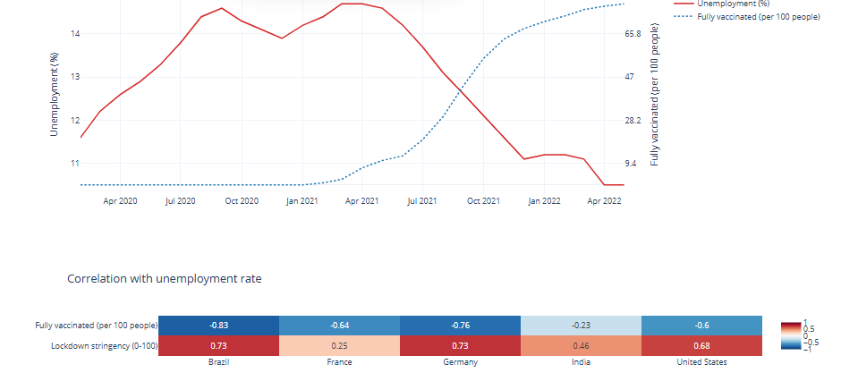
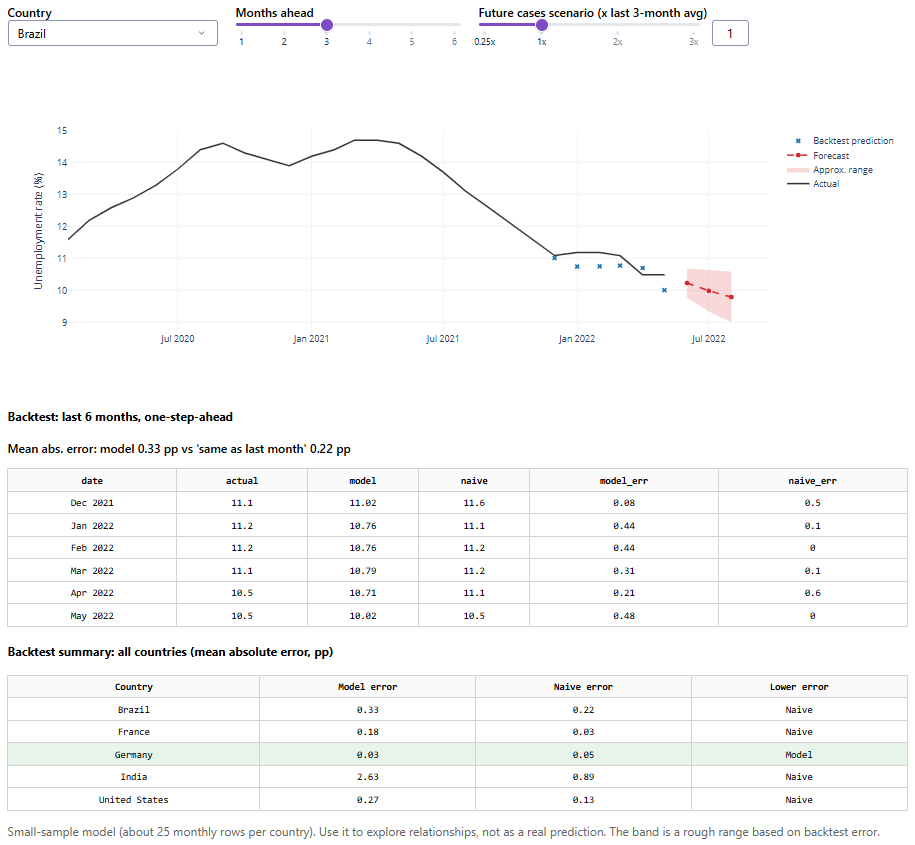
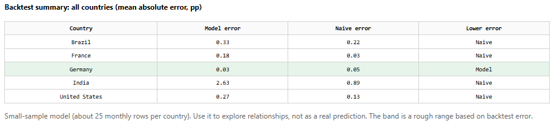

# 🦠📈📊 COVID-19 and Unemployment: Time-Series Analytics and ML Forecasting Dashboard

**Contributors:** Marco Ortiz · Tania Ortiz

An interactive **Plotly Dash** dashboard that explores how monthly COVID-19 case counts relate to unemployment rates in the United States, Brazil, India, France and Germany (January 2020 – May 2022), with policy context (vaccination and lockdown stringency) and a small, honestly evaluated forecasting model.



## 📃 Table of Contents

1. [Project Overview](#-project-overview)
2. [Project Goals](#-project-goals)
3. [Project Summary](#-project-summary)
4. [Dashboard Tour](#-dashboard-tour)
5. [Key Takeaways](#-key-takeaways)
6. [Findings by Country](#-findings-by-country)
7. [Key Accomplishments](#-key-accomplishments)
8. [Limitations and Caveats](#-limitations-and-caveats)
9. [Future Improvements](#-future-improvements)
10. [Files](#-files)
11. [Tools and Libraries](#-tools-and-libraries)
12. [How to Run](#-how-to-run)
13. [Data Sources](#-data-sources)

## 📝 Project Overview

This project began in May 2025 as a Jupyter notebook (Pandas, Seaborn, Plotly) that tested whether pandemic waves lined up with labor-market disruption. It has since grown into a multi-tab Plotly Dash application that lets a reader explore the same question interactively, add policy context, and see how well a simple model can forecast unemployment.

The central question: **did rising COVID-19 case counts coincide with rising unemployment, and does the answer depend on the country?**

## 🎯 Project Goals

- Examine the correlation between rising COVID-19 case numbers and unemployment rates.
- Explore unemployment trends before, during, and after COVID-19 peaks.
- Visualize the pandemic's impact with interactive time-series charts, heatmaps and scatter plots.
- Add policy context (vaccination, lockdown stringency) to the picture.
- Test whether a simple model can forecast unemployment, and report honestly how it performs.
- Generate insights to inform post-pandemic labor-market recovery discussions.

## 📊 Project Summary

- 📁 **Core dataset:** 141 monthly rows from 5 countries (January 2020 – May 2022)
- 🧮 **Core columns:** Country, Date, New Covid Cases, Unemployment Rate
- 🏛️ **Policy columns (added):** lockdown stringency index (0–100, monthly average) and fully vaccinated per 100 people (monthly maximum), from Our World in Data
- 📌 **Records per country:** United States 29 · Brazil 28 · India 28 · France 28 · Germany 28
- 📉 **Analysis scope:**
  - Time-series trends of cases and unemployment per country
  - Pearson correlation at lags of 0–6 months, plus scatter plots with linear fits
  - Event-study view aligned on each country's case peak
  - Policy context overlays and correlations
  - Walk-forward backtest of a Ridge-regression forecaster against a naive baseline

## 🧭 Dashboard Tour

The dashboard is built to be read as a story in five steps: **what happened → how strongly the two series move together → what happened around the peaks → what policy was doing → can we forecast it?**

### 1. Trends: what happened


Cases (top) and unemployment (bottom) for every selected country, with an optional log axis for cases. Case counts differ by orders of magnitude between countries, so the log axis helps when comparing waves.

**What the data shows**
- **United States:** unemployment jumped from 3.5% (Feb 2020) to **14.7% in April 2020**, then fell steadily to 3.6% by March 2022. The biggest case wave came much later, in January 2022 (about **20.3 million** new cases), when unemployment was around 4.0%.
- **India:** unemployment reached **23.52% in April 2020** and 21.73% in May 2020, when monthly cases were still small (about 25,000 and 93,000). During the second wave, cases peaked in April 2021 (about **3.17 million**) and unemployment rose from 7.97% to **11.84% in May 2021**.
- **Brazil:** unemployment climbed from 11.6% (Feb 2020) to **14.7% in March–April 2021**, a period of high case counts, and then eased to 10.5% by spring 2022, even through a 2.63 million-case wave in January 2022.
- **Germany and France:** much smaller swings. Germany peaked at 6.4% (June 2020) and ended at 5.0%; France peaked at 8.9% (Aug–Sep 2020) and ended at 7.2%.

<!-- ✍️ YOUR NARRATIVE: what should a first-time viewer notice here? (e.g. the gap between when unemployment spiked and when case counts peaked) -->

### 2. Correlation: how strongly do they move together?



Each cell is the Pearson correlation between cases and the unemployment rate. **Lag 0** compares the same month (matching the original notebook). **Lag k** pairs cases from *k months earlier* with this month's unemployment.

| Country | Lag 0 | Lag 1 | Lag 2 | Lag 3 | Lag 4 |
|---|---|---|---|---|---|
| United States | −0.21 | −0.29 | −0.38 | −0.44 | −0.43 |
| India | −0.11 | −0.02 | −0.17 | −0.19 | −0.14 |
| Germany | −0.57 | −0.62 | −0.62 | −0.55 | −0.53 |
| France | −0.36 | −0.39 | −0.38 | −0.37 | −0.36 |
| Brazil | +0.18 | +0.11 | −0.04 | −0.20 | −0.17 |



**What the data shows**
- **Germany** has the strongest relationship (−0.57 at lag 0, −0.62 at lags 1–2), and it is *negative*: its biggest case counts came when unemployment was already low.
- **Brazil** is the only country with a positive correlation at lag 0 (+0.18), but that is weak, not moderate, and it turns slightly negative from lag 2.
- **United States** gets more negative as the lag grows (−0.21 → −0.44 at lag 3).
- **India** is close to zero throughout. Its lockdown-era unemployment spike (April–May 2020) happened *before* case counts were high, which breaks any simple relationship.
- In the scatter plots, single extreme points (the US January 2022 case spike, India's 23.5% unemployment) heavily influence the fitted lines.

> A negative correlation here does **not** mean cases reduce unemployment. It mostly reflects timing: unemployment spiked early, while the largest case waves arrived later, when labor markets had recovered and case counts were higher.

<!-- ✍️ YOUR NARRATIVE: why does timing matter more than size here? -->

### 3. Before, during and after peaks: what happened around the waves?



Each line shows the change in unemployment (percentage points) relative to the month of that country's largest case peak (month 0), within a ±6 month window. A second option restricts the search to each country's first 12 months to isolate the first wave.

| Country | Largest case peak |
|---|---|
| Brazil | January 2022 |
| France | January 2022 |
| Germany | March 2022 |
| India | April 2021 |
| United States | January 2022 |

**What the data shows**
- For **Brazil, France, Germany and the United States**, the largest peak is the Omicron wave, which sits only 3–5 months before the data ends, so there is very little "after". Unemployment was already falling into these peaks (Brazil and the US were 2.5 and 1.4 points higher six months before) and stayed flat or slightly lower afterwards.
- **India** is the exception: unemployment rose by about **3.9 points the month after** its April 2021 peak (7.97% → 11.84%) before falling back within three months.

<!-- ✍️ YOUR NARRATIVE: India's second wave vs. the Omicron wave elsewhere -->

### 4. Policy context: what was government doing?







Unemployment (solid red) is overlaid on a policy variable (dotted blue, right axis). The heatmap summarizes the correlation between unemployment and each policy variable for all five countries.

| Variable | Brazil | France | Germany | India | United States |
|---|---|---|---|---|---|
| Fully vaccinated per 100 | −0.83 | −0.64 | −0.76 | −0.23 | −0.60 |
| Lockdown stringency (0–100) | +0.73 | +0.25 | +0.73 | +0.46 | +0.68 |

**What the data shows**
- Vaccination is negatively correlated with unemployment in every country (strongest in Brazil, −0.83; weakest in India, −0.23).
- Stringency is positively correlated everywhere, strongest in Brazil and Germany (+0.73) and weakest in France (+0.25).
- In **Germany**, stringency was highest in winter 2020–21 (roughly 80+ on the 0–100 scale) while unemployment was already easing from its June 2020 peak.
- In **Brazil**, vaccination began rising in early 2021 around the unemployment peak, and unemployment fell as coverage rose above 65 per 100 by early 2022.

> These are **co-movements, not effects**. Vaccination only ever rises over time and unemployment mostly fell after 2020, so the two correlate strongly even if neither caused the other. Treat the heatmap as context, not as proof.

<!-- ✍️ YOUR NARRATIVE: what do stringency and vaccination add to the story, and what can't they tell us? -->

### 5. Forecast: can we predict unemployment?



A Ridge regression predicts each month's **change** in unemployment from the previous two months of unemployment, the previous two months of (log) cases, and last month's policy variables. For forecasts, future case counts are a **scenario** the viewer controls (last three-month average × a multiplier). The shaded band is a rough range based on backtest error.

The model is tested with a **walk-forward backtest** on each country's last six months: refit using only earlier data, predict the next month, repeat. It is compared against the naive baseline, "unemployment stays the same as last month".



| Country | Model error (pp) | Naive error (pp) | Lower error |
|---|---|---|---|
| Brazil | 0.33 | 0.22 | Naive |
| France | 0.18 | 0.03 | Naive |
| Germany | 0.03 | 0.05 | **Model** |
| India | 2.63 | 0.89 | Naive |
| United States | 0.27 | 0.13 | Naive |

**What the data shows**
- The model beat the baseline only in **Germany**, and only narrowly (0.03 vs 0.05 pp).
- Predicting the monthly *change* instead of the level cut the US error from 1.31 to 0.27 pp (about 80%), because it stopped the huge case spikes from dragging the prediction around. It did not change the ranking: the naive baseline still won there.
- With about 25 usable months per country and very persistent unemployment, a lag-based model has little to add. That is a legitimate finding.

**India deep-dive (`india_test.py`).** To check whether India's April–May 2020 lockdown spike was distorting the model, we retrained it with April–July 2020 removed from the training data (April and May hold the spike; June and July use them as lags):

| India, last 6 months | Mean absolute error (pp) |
|---|---|
| Model, trained on all data | 2.63 |
| Model, April–July 2020 removed | 1.53 |
| Same as last month | 0.89 |

Removing the spike months cut India's model error by about **42%**, but the naive baseline still won. As a control, the same test on Brazil (which has no such spike) barely changed (0.33 → 0.32 pp). The result is suggestive, not conclusive: the backtest covers only six months, and we chose the trimming window after looking at the data.

<!-- ✍️ YOUR NARRATIVE: what does it mean that a "dumb" baseline beats the model? -->

## 🔑 Key Takeaways

- **The relationship is country-dependent and mostly about timing.** Unemployment spiked early (especially in the US and India); the largest case waves came later.
- **The US and India saw steep early spikes** in unemployment (14.7% and 23.52%), followed by recovery.
- **Brazil kept high unemployment for the whole period**, peaking in spring 2021 and easing slowly. Its link to case counts is weak at best (+0.18 at lag 0).
- **Germany and France stayed relatively stable**, consistent with strong labor-market and welfare protections (an interpretation, not something this dataset tests).
- **Policy variables co-move with unemployment but cannot be read causally**, because vaccination and unemployment both trend over time.
- **A simple forecaster rarely beats "same as last month"** with this little data.

## 🌍 Findings by Country

| Country | Unemployment: Feb 2020 → peak → May 2022 | Largest case wave | Correlation (lag 0) |
|---|---|---|---|
| United States | 3.5% → **14.7%** (Apr 2020) → 3.6% | Jan 2022 (~20.3M) | −0.21 |
| India | 7.76% → **23.52%** (Apr 2020) → 7.12% | Apr 2021 (~3.17M) | −0.11 |
| Brazil | 11.6% → **14.7%** (Mar–Apr 2021) → 10.5% | Jan 2022 (~2.63M) | +0.18 |
| France | 7.8% → **8.9%** (Aug–Sep 2020) → 7.2% | Jan 2022 (~6.85M) | −0.36 |
| Germany | 5.0% → **6.4%** (Jun 2020) → 5.0% | Mar 2022 (~4.52M) | −0.57 |

- **United States:** sharp spike in April 2020, weakly (negatively) correlated with the later pandemic waves.
- **India:** the highest unemployment of any country, driven by the lockdown, plus a second-wave bump in May 2021.
- **Brazil:** persistently high unemployment; only country with a positive lag-0 correlation, but weak.
- **Germany and France:** small unemployment swings, possibly reflecting social-welfare and job-retention programs.

## 📌 Key Accomplishments

- Cleaned and structured 141 monthly observations from an Excel file (including month-level date handling).
- Built a five-tab interactive Plotly Dash dashboard.
- Quantified relationships with Pearson correlations at multiple lags, not just the same month.
- Added an event-study view around each country's case peak.
- Merged in vaccination and lockdown-stringency data with a pipeline that degrades gracefully when optional data is missing.
- Built a forecasting model with a proper walk-forward backtest and a naive baseline, and reported where it fails.
- Investigated an outlier hypothesis (India's lockdown spike) with a reproducible script and a control country.

## ⚠️ Limitations and Caveats

- **Small sample:** about 28 monthly observations per country. Correlations are sensitive to single points, and the forecast backtest uses only six months.
- **Correlation is not causation.** Many series here share time trends.
- **Cross-country comparability:** case reporting, testing intensity and unemployment definitions differ by country.
- **Monthly aggregation** hides within-month dynamics.
- **Policy data:** stringency is a monthly average and vaccination a monthly maximum of daily Our World in Data values; vaccination is treated as 0 before the first report.
- **Not yet included:** stimulus data and any period after May 2022.
- **The forecast is exploratory, not predictive.** Future cases are a user-chosen scenario.

## 🔮 Future Improvements

**Implemented from the original roadmap**

- ✅ Vaccination rates and lockdown stringency index (Policy context tab)
- ✅ Machine-learning forecasting of unemployment from pandemic-related variables (Forecast tab)
- ✅ Interactive dashboard in Plotly Dash

**Partly implemented**

- ⚠️ **Economic stimulus data:** the pipeline reads an optional `data/stimulus.csv` (`country,date,stimulus_pct_gdp`), but no stimulus data has been added yet.
- ⚠️ **Timeline beyond 2022:** appending rows to the Excel file flows through every tab automatically, but the dataset still ends in May 2022.

**Next ideas**

- Source and add stimulus data, and extend the timeline to capture the full post-pandemic recovery.
- Add more countries.
- Try outlier-robust models, longer backtests and multi-step evaluation.
- Surface the India lockdown-spike test inside the dashboard.
- Deploy publicly (the Flask server is already exposed as `server = app.server` for `gunicorn app:server`).

## 📂 Files

```
COVID-19-UER-Analytics/
├── app.py                      # Plotly Dash dashboard (5 tabs)
├── data_prep.py                # loading, cleaning and merging data
├── forecast.py                 # Ridge-regression forecaster + walk-forward backtest
├── india_test.py               # India lockdown-spike sensitivity test
├── fetch_context_data.py       # downloads Our World in Data (vaccination, stringency)
├── requirements.txt
├── README.md
├── data/
│   ├── COVID-19 Project COVID Cases.xlsx   # core dataset
│   ├── owid-covid-data.csv                 # downloaded, git-ignored
│   └── stimulus.csv                        # optional (not included yet)
└── screenshots/                # images used in this README
```

The original May 2025 notebook (`COVID-19 and Unemployment Rate Analytics.ipynb`) and its exported charts are kept as the project's starting point.

## 🔧 Tools and Libraries

- **Python**: main programming language
- **Plotly Dash**: the interactive dashboard (all visualizations are Plotly figures)
- **Pandas / NumPy**: reading the Excel file, cleaning, merging, lag features
- **scikit-learn**: Ridge regression (with a numpy fallback in `forecast.py`)
- **openpyxl**: reading `.xlsx` files

The original notebook also used Matplotlib and Seaborn for static charts; the dashboard itself uses Plotly only.


## 🗂️ Data Sources

- **Cases and unemployment rates:** the project's Excel dataset <!-- ✍️ ADD the original sources for the case counts and unemployment rates -->
- **Lockdown stringency and vaccination:** [Our World in Data](https://ourworldindata.org/coronavirus) COVID-19 dataset, downloaded via `fetch_context_data.py`
